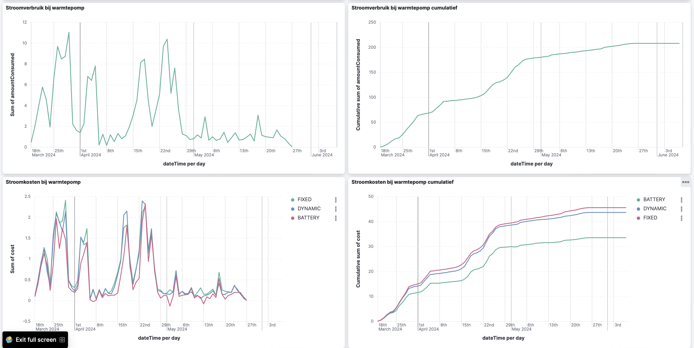

# Energy simulator
This project aims to take your energy consumption data and run what-if scenarios on it. So for
example you could simulate if you have a home battery in place, a heat pump instead of your
gas-powered heater and so forth.

## Set up runtime
First, start the docker containers:
```
docker compose up -d
```

## Configure your specific information
Next, you need to set your config in application.yml. There are a few values you need to configure.

You need to set the prices for a fixed contract:

```yaml
contract:
  fixed:
    power:
      t1: 0.22145
      t2: 0.20935
    gas: 0.99179
```

You need to refer to the files where you have stored your power and gas data:
```yaml
files:
  power: P1e-2024-3-19-2024-5-26.csv
  gas: P1g-2024-3-19-2024-5-26.csv
```

You need to specify the amount of tax you are paying per kWh/m3:
```yaml
tax:
  power: 0.13165
  gas: 0.70544
```

And you need to specify the scop value of the heat pump you are potentially interested in placing:
```yaml
scop: 4.0
```

## Start the application
```
mvn spring-boot:run
```

## Run simulations
Now run a simulation as follows:
```
curl "http://localhost:8080/import/power?source=dynamic"
curl "http://localhost:8080/import/power?source=fixed"
curl "http://localhost:8080/import/power?source=battery"
curl "http://localhost:8080/import/gas?source=dynamic&heating=boiler"
curl "http://localhost:8080/import/gas?source=fixed&heating=boiler"
curl "http://localhost:8080/import/gas?source=dynamic&heating=heatpump"
curl "http://localhost:8080/import/gas?source=fixed&heating=heatpump"
curl "http://localhost:8080/import/gas?source=battery&heating=heatpump"
```

## Import dashboards
After running your simulations you can view your data in [Kibana](http://localhost:5601)

To import the dashboards, click the three bars in the top-left of the Kibana screen, navigate to "Stack Management".
There you can import the dashboards, select import and choose the file [ElasticEnergyCostsDashboards.ndjson](ElasticEnergyCostsDashboards.ndjson)

Now you can see your data and make smart decisions about what is right for your energy needs in your home.

